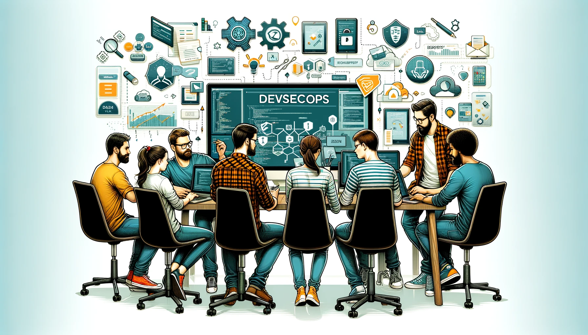

# Synchronising Success and the Role of Team Collaboration in DevSecOps

## Introduction
As a Lead Principal Engineer, I have been deeply involved in Identity and Access Management (IAM), DevOps and cross-platform co-creation initiatives across various technology platforms in the UK financial services sector. 

In our digital age, particularly in financial services, security must be integrated into each phase of development, and the traditional siloed approach to development, security, and operations is no longer viable. The challenge I see for large enterprises is to build a culture where development, security, and operations teams work together flawlessly. 

This post explores the essential role of team collaboration in DevSecOps, highlighting common obstacles and how overcoming them can greatly enhance our security posture and operational efficiency.

## The Need for Collaboration
The essence of DevSecOps lies in its ability to bring together diverse skill sets and perspectives from development, security, and operations teams. Historically, isolated security and operations teams have led to bottlenecks, dependencies, security risks, and delays. Early efforts to adopt DevSecOps principles initially met resistance, rooted in cultural inertia and misunderstanding. Yet, through targeted communication and inclusive team-building, we're witnessing a shift towards a unified, security-first mindset. 

## Envisioning the Future
I envision a workplace where DevSecOps is a core practice, not just a trendy term. A future where engineering leaders guide their teams towards achieving secure, efficient, and innovative solutions. This future is within reach through continuous collaboration, shared responsibilities, and a commitment to continuous learning.

## Practical Insights and Best Practices
I'd like to share a few insights and best practices that may help fellow engineering leaders to improve their DevSecOps practices.
- **Automated Security Pipelines**: Automated security checks integrated within CI/CD pipelines, ensure Static Application Security Testing (SAST) and Dynamic Application Security Testing (DAST) is part of the development and deployment process. 
- **Security Review Sessions**: Building solutions using security patterns and embedding security assessments to the design process facilitates proactively identifying and addressing potential threats.
- **Security Champions**: Embedding security advocates within your development teams will nurture a security-first approach throughout your processes.
- **Dependency Management**: Team collaboration in DevSecOps is not just about working together; it's about synchronising efforts towards a common goal.  Release Train Managers can create huge value by monitoring, managing and prioritising cross-team dependencies closely, which enables better planning, transparency and faster delivery. 
- **Virtual Cross-functional Teams**: Establishing virtual teams for cross-platform initiatives brings together experts from all relevant fields, ensuring solutions are simple, reusable, secure, and resilient. It has a secondary positive effect on building your global engineering community, removing siloes, and facilitating cross pollination and knowledge sharing between platforms.

## Commitment to Excellence
Your team committed to deliver secure and efficient solutions by embracing DevSecOps best practices, can exceed your customers' security expectations at every product lifecycle stage. Understanding the significance of team collaboration in DevSecOps, coupled with best practice knowledge sharing and supported by industry best practice DevSecOps tooling is a game-changer to secure your solutions and platforms. 

## Challenges and Success Stories
Fostering a collaborative DevSecOps culture has its challenges. Initial resistance often stemmed from a lack of understanding and fear of change. Creating opportunities for cross-team engagements can be pivotal in overcoming these barriers. Transition to automated security pipelines, which significantly reduce vulnerabilities and accelerates deployment cycles is a huge enabler which does not only improve security posture but also serves as a testament to the power of collaboration and shared vision.

## Conclusion
The journey to embedding DevSecOps principles within your teams demands patience, focus, and, most importantly, teamwork. Leaders must champion the importance of teamwork, provide the necessary resources and support, and foster an environment where learning from failures is encouraged. Recognizing and rewarding collaborative efforts is equally important in sustaining a positive and productive team dynamic. By leading through example and fostering an environment where collaboration is part of the culture, you can redefine the standards of security and efficiency in the industry.

## Invitation to Share
- What challenges have you encountered in promoting a collaborative DevSecOps culture within your organisation?
- Are there any success stories or case studies you can share where enhanced collaboration led to significant security and operational improvements?

## Contributing through comments
It would be great to hear your thoughts on this article by commenting on the page or contacting me through Medium, LinkedIn or Twitter below. I am happy to bounce ideas or chat about the topic so feel free to contact me to have further discussion, share what you have learned or tell me your ideas on how to bring developers, security and operations teams together effectively.

### Get mentored by Miklos
https://www.mentoring-club.com/the-mentors/miklos-sagi 

### Connect to Miklos on Medium
https://medium.com/@miklos.sagi 

### Connect to Miklos on LinkedIn
https://www.linkedin.com/in/miklossagi/ 

### Follow Miklos on X
https://twitter.com/SagiMiklos 
